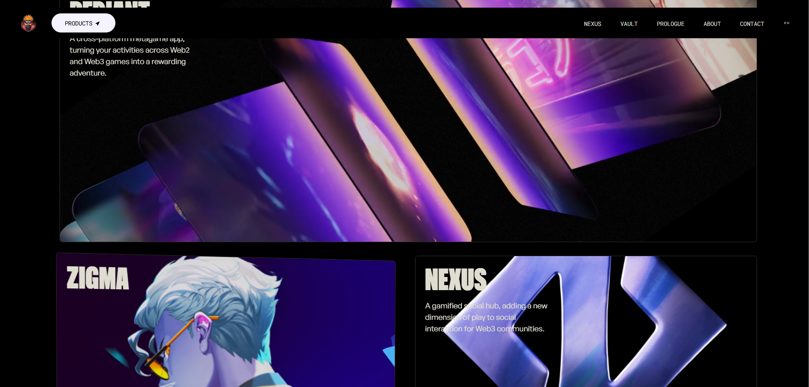

<div align="center">

  
  
  # 🌐 Awwwards-Winning Website Clone

  **Crafted with React, Tailwind CSS, and GSAP for silky-smooth animations and a cutting-edge user experience.**
  
  [🚀 Live Demo](https://awwwards-gajendra.vercel.app) • [🐞 Report Bug](https://github.com/0xGajendra/awwwards/issues/)

  
  
  
  

</div>

---

## 🚨 About the Project
This project replicates an Awwwards-winning website with:
- Smooth page transitions and animations 🌀
- Fully responsive design 📱
- Modern UI/UX inspired by top-tier web designs 🎨

## 📸 Gallery
<div align="center" >
  
  
  
</div>

## ⚙️ Tech Stack
- **Frontend:** React, JavaScript, Tailwind CSS
- **Animations:** GSAP

## 🚀 Getting Started
1. Clone the project:
```bash
  git clone https://github.com/0xGajendra/awwwards
```
2. Go to the project directory:
```bash
  cd awwwards
```
3. Install dependencies:
```bash
  npm install
```
4. Start the server:
```bash
  npm run dev
```

## 🏆 Contributing
Contributions are what make the open-source community amazing. Feel free to fork the repo, create a feature branch, and open a pull request.

<a href="https://github.com/0xGajendra/awwwards/contributors">
  
</a>

## 📬 Contact
**Your Name** — [Linked In](https://www.linkedin.com/in/gajendra-li/) — gajendrapawar69@gmail.com

Project Link: [Awwwards-Winning Website Clone](https://github.com/0xGajendra/awwwards)

---

⭐ **Massive shoutout to [JavaScript Mastery](https://www.youtube.com/c/JavaScriptMastery) for the epic tutorial!** 🙌

